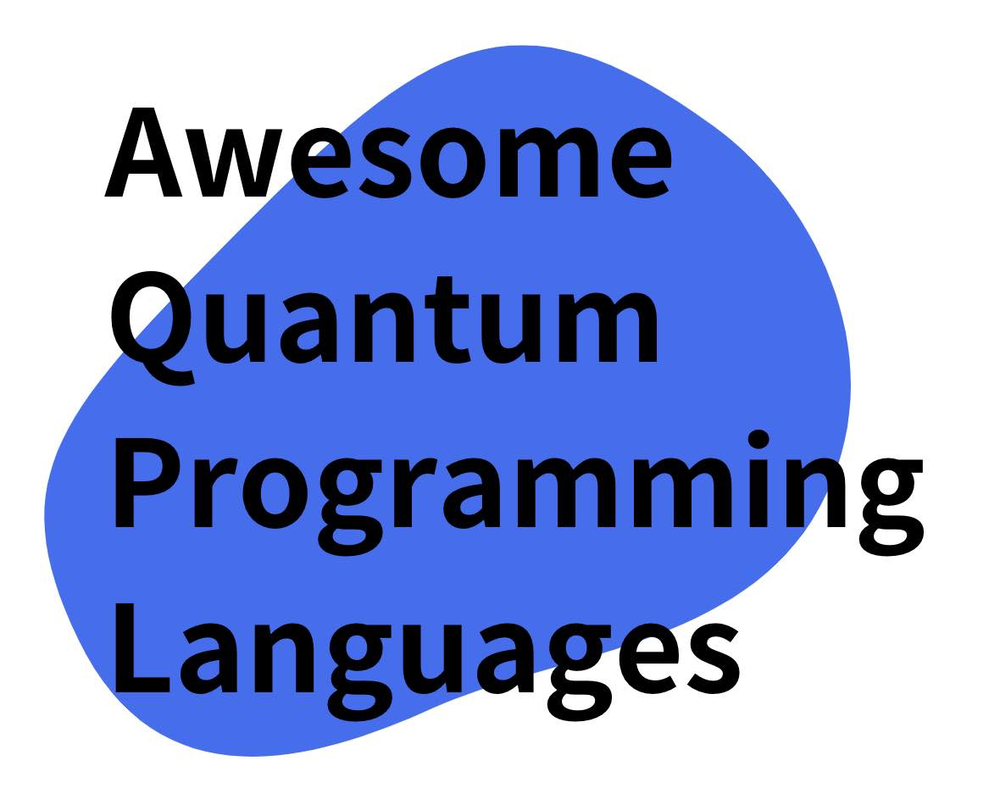

# awesome quantum programming languages

This site is a curation of programming languages, libraries, and simulators for quantum computation.  

  

Please read the [contribution guidelines](https://github.com/fuyu-quant/awesome-quantum-programming-languages/blob/main/contributing.md) before contributing. Please add quantum programming language, libraries, simulators by raising a pull request.

## Contents
* [programming language](#Programming language)
    * [Python](#Python)
        * Gated-based quantum computers
        - Masurement-based quantum computers(One-way quantum computer)
        - Quantum computing with neutral atoms
        - Linear optical quantum computing
        - Quantum annealing

    - Julia
        - Gated-based quantum computers
        - Quantum annealing

    - C++
    - Q#
    - QCL
    - Quipper
- Others
- Reference
- Contributors
- Credits
- License

## Programming language

### Python
#### Gated-based quantum computers

- [Qiskit](https://qiskit.org/)-IBMが提供するPythonのゲート型量子計算ライブラリ  
developer:IBM
- [PennyLane](https://pennylane.ai/)-XANADUが提供するPythonのゲート型量子計算ライブラリ
- [Cirq](https://quantumai.google/cirq)-Googleが提供するPythonのゲート型量子計算ライブラリ
- [TensorFlowQuantum](https://www.tensorflow.org/quantum)-Googleが提供するPythonの量子と古典ハイブリッド機械学習用のライブラリ
- [Blueqat](https://blueqat.readthedocs.io/en/latest/)-blueqatが提供するPythonのゲート型量子計算ライブラリ
- [Qulacs](http://docs.qulacs.org/en/latest/)-QunaSysが提供するPython，C++のゲート型量子計算ライブラリ
- [PaddleQuantum](https://qml.baidu.com/)
- [torchquantum](https://github.com/mit-han-lab/torchquantum)
- [Qulacs](http://docs.qulacs.org/en/latest/)-QunaSysが提供するPython，C++のゲート型量子計算ライブラリ
- [scikit-qulacs](https://qulacs-osaka.github.io/scikit-qulacs/index.html)
- [mitiq](https://mitiq.readthedocs.io/en/stable/)
- [ProfectQ](https://github.com/ProjectQ-Framework/ProjectQ)
- [pyquil](https://github.com/rigetti/pyquil)  
developer:Rigetti Computing
- [pytket](https://cqcl.github.io/tket/pytket/api/index.html)  
developer:Quantinuum

#### Masurement-based quantum computers(One-way quantum computer)
- [PaddleQuantum](https://qml.baidu.com/)
    https://qml.baidu.com/tutorials/measurement-based-quantum-computation/mbqc-quick-start-guide.html

#### Quantum computing with neutral atoms
- [Pulser](https://pulser.readthedocs.io/en/stable/index.html)

#### Linear optical quantum computing
- [StrawberryFields](https://strawberryfields.ai/)-XANADUが提供するPythonの光連続量量子計算ライブラリ

#### Quantum annealing
- [Ocean](https://docs.ocean.dwavesys.com/en/stable/packages.html)
- [OpenJij](https://github.com/OpenJij/OpenJij)

### Julia

#### Gated-based quantum computers
- [Yao](https://yaoquantum.org/)

#### Quantum computing with neutral atoms
- [Bloqade](https://queracomputing.github.io/Bloqade.jl/dev/)-QuEraが提供するJuliaの中性原子シミュレーションライブラリ

#### Quantum annealing

### JavaScript
#### Gated-based quantum computers
- [Qiskit.js](https://github.com/qiskit-community/qiskit-js)  
developer:IBM

### C++
#### Gated-based quantum computers
- [Qulacs](http://docs.qulacs.org/en/latest/)-QunaSysが提供するPython，C++のゲート型量子計算ライブラリ
- [Qrack](https://vm6502q.readthedocs.io/en/latest/)
- [Quantum++](https://github.com/softwareQinc/qpp)

### [Q#](https://learn.microsoft.com/en-gb/azure/quantum/?view=qsharp-preview)
developer:Microsoft

### [QCL](http://tph.tuwien.ac.at/~oemer/qcl.html)

### [Quipper](https://www.mathstat.dal.ca/~selinger/quipper/)

## Reference
- [awesome-quantum-computing](https://github.com/desireevl/awesome-quantum-computing#readme)
- [awesome-qsharp](https://github.com/ebraminio/awesome-qsharp#readme)

## Contributors

## License
[License](https://github.com/fuyu-quant/awesome-quantum-computing/blob/main/LICENSE)-CC0

